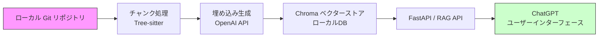

# RAG (Retrieval-Augmented Generation) 社内導入ガイド

このリポジトリは、Gitソースコードをローカルでインデックス化し、OpenAIサービスを利用してチャンクの埋め込みと生成を行うRAGパイプラインのサンプル実装です。

---
## 目次 (Table of Contents)
- [RAG (Retrieval-Augmented Generation) 社内導入ガイド](#rag-retrieval-augmented-generation-社内導入ガイド)
  - [目次 (Table of Contents)](#目次-table-of-contents)
  - [1. 前提条件 (Prerequisites)](#1-前提条件-prerequisites)
  - [2. システム構成図 (Architecture Diagram)](#2-システム構成図-architecture-diagram)
  - [3. クイックスタート (Quick Start)](#3-クイックスタート-quick-start)
  - [4. 詳細セットアップ手順 (Detailed Setup)](#4-詳細セットアップ手順-detailed-setup)
    - [Windows ネイティブ](#windows-ネイティブ)
    - [WSL2 (Ubuntu)](#wsl2-ubuntu)
  - [5. 設定ファイル (.env) の説明 (Configuration Files)](#5-設定ファイル-env-の説明-configuration-files)
  - [6. インデックス更新フロー (Index Update Flow)](#6-インデックス更新フロー-index-update-flow)
  - [7. API の使い方 (API Usage)](#7-api-の使い方-api-usage)
    - [エンドポイント例](#エンドポイント例)
    - [cURL 例](#curl-例)
    - [リクエスト/レスポンス例](#リクエストレスポンス例)
  - [8. トラブルシューティング (Troubleshooting)](#8-トラブルシューティング-troubleshooting)
  - [9. コストとガバナンス (Cost \& Governance)](#9-コストとガバナンス-cost--governance)
  - [10. メンテナンス・アップグレード方針 (Maintenance \& Upgrade)](#10-メンテナンスアップグレード方針-maintenance--upgrade)
  - [11. FAQ](#11-faq)
  - [12. RAG 環境のセットアップ \& 配布手順](#12-rag-環境のセットアップ--配布手順)
    - [✅ 前提](#-前提)
    - [📦 配布元（リポジトリ作成者）が行う作業](#-配布元リポジトリ作成者が行う作業)
      - [1. `.env.example` の準備](#1-envexample-の準備)
      - [2. `.gitignore` の確認・調整](#2-gitignore-の確認調整)
      - [3. `requirements.txt` のバージョンロック（例）](#3-requirementstxt-のバージョンロック例)
      - [4. `index_metadata.json` の追加（オプション）](#4-index_metadatajson-の追加オプション)
      - [5. README.md への記述（抜粋）](#5-readmemd-への記述抜粋)
    - [⚠ 注意点](#-注意点)
    - [💡 補足: Git LFS の使い方](#-補足-git-lfs-の使い方)
  - [13. コントリビューションガイド (Contribution)](#13-コントリビューションガイド-contribution)
  - [14. 参考資料リンク集 (References)](#14-参考資料リンク集-references)

## 1. 前提条件 (Prerequisites)
- **OS**: Windows 10/11, Ubuntu 20.04 以上 推奨
- **Python**: 3.11
- **必須ツール**:
-   - Git
-   - PowerShell (Windowsネイティブの場合)
-   - Visual Studio Build Tools (WindowsでのC拡張ビルド用)
- **WSL2 対応環境**: Windows上でUbuntu等のLinuxディストリビューションを利用する場合はWSL2を有効化
- **GPU 利用**: GPUを用いた高速化は未対応（CPU実行が前提）。GPU対応を検討する場合は`chromadb[tikv]`等の拡張を導入してください

## 2. システム構成図 (Architecture Diagram)


## 3. クイックスタート (Quick Start)
```bash
# 1. gitリポジトリの準備
# 1.1 リモートリポジトリが対象の場合
git clone https://.../sample_rag_repo.git
cd sample_rag_repo

# 1.2 ローカルの非gitリポジトリディレクトリが対象の場合
git init # 対象ディレクトリ直下で
git add .

# 2. .envファイルをコピーし、環境変数を設定
cp .env.example .env

# 3. Python仮想環境を作成・有効化
python -3.11 -m venv .venv
source .venv/bin/activate  # Windows PowerShell: .\.venv\Scripts\Activate.ps1

# 4. 依存ライブラリをインストール
pip install --upgrade pip
pip install -r requirements.txt

# 5. インデックスを構築
python -m ingest.ingest

# 6. サーバーを起動
source .venv/bin/activate  # Windows PowerShell: .\.venv\Scripts\Activate.ps1
uvicorn rag_api.app:app --host 0.0.0.0 --port 8000
```

## 4. 詳細セットアップ手順 (Detailed Setup)
### Windows ネイティブ
1. PowerShellを管理者権限で起動し、必要ツールをインストール
2. Python公式サイトから3.8以上をインストール
3. Visual Studio Build Toolsをインストール
4. 以降はWSL2手順参照以外の処理

### WSL2 (Ubuntu)
```bash
# WSL2有効化後
sudo apt update && sudo apt install -y python3 python3-venv git
git clone https://.../sample_rag_repo.git
cd sample_rag_repo
python3 -m venv .venv && source .venv/bin/activate
pip install --upgrade pip && pip install -r requirements.txt
```

## 5. 設定ファイル (.env) の説明 (Configuration Files)
| ファイル           | 用途                                                |
| ------------------ | --------------------------------------------------- |
| `.env.example`     | サンプル環境変数定義                                |
| `.env`             | 実際に読み込まれる環境変数。必ず`.env.example`からコピー |
| `.env.local`       | ローカル開発用に`.env`をオーバーライド              |

主な環境変数:
```env
OPENAI_API_KEY=<YOUR_API_KEY>
CODE_REPO_PATH=/path/to/your/git/repository
MAX_TOKENS_PER_BATCH=300000
CHROMA_DB_PATH=./code_index
EXTENSIONS=py,js,ts,go,cpp
```

## 6. インデックス更新フロー (Index Update Flow)
- **手動実行**: `python -m ingest.ingest`
- **差分埋め込みの所要時間**: 1000ファイルあたり約1分
- **Gitフック運用**: `pre-commit`や`post-commit`フックで自動更新可能（例: `.git/hooks/pre-commit`にスクリプトを配置）

## 7. API の使い方 (API Usage)
### エンドポイント例
| メソッド | パス           | 説明                      |
| -------- | -------------- | ------------------------- |
| GET      | `/health`      | ヘルスチェック           |
| POST     | `/query`       | RAGクエリ実行            |

### cURL 例
```bash
curl -X POST http://localhost:8000/query \
     -H 'Content-Type: application/json' \
     -d '{"query": "関数定義の取得方法を教えて"}'
```

### リクエスト/レスポンス例
```json
{
  "query": "関数定義の取得方法を教えて"
}
```
```json
{
  "result": [
    {
      "source": "example.py",
      "code": "def example():\n    pass"
    }
  ]
}
```

## 8. トラブルシューティング (Troubleshooting)
| エラー内容                                 | 対応方法                                            |
| ------------------------------------------ | --------------------------------------------------- |
| `Token超過`                                | `MAX_TOKENS_PER_BATCH`の見直し                      |
| `ModuleNotFoundError: ingest.chunker`      | パスのimport修正または`PYTHONPATH`設定を確認       |
| `chromadb.errors.NoPersistenceError`       | `CHROMA_DB_PATH`の権限・パスを確認                 |

## 9. コストとガバナンス (Cost & Governance)
- **OpenAI 埋め込みAPI 料金**: ~0.0004 USD/1Kトークン
- **APIキー管理**: 環境変数管理、Vaultでの安全保管
- **ログ/データ取扱い**: ローカル環境にて履歴削除ポリシーを設定

## 10. メンテナンス・アップグレード方針 (Maintenance & Upgrade)
- `langchain` / `chromadb` の新バージョンは半年ごとに追従を検討
- `requirements.txt`の更新後は`pip install -r requirements.txt`を再実行

## 11. FAQ
**Q: なぜローカルLLMではないのか?**  
A: OpenAI API利用により高品質な埋め込みと生成を低レイテンシで利用可能。

**Q: モデルをカスタマイズできるか?**  
A: EmbeddingモデルはOpenAI Tuning対応を検討中。Local LLM統合は現状非対応。

## 12. RAG 環境のセットアップ & 配布手順

### ✅ 前提
- ベクトルストア: Chroma(`langchain_chroma`)
- 永続化パス: `code_index/`
- Embedding: `OpenAIEmbeddings(model="text-embedding-3-small", dimensions=1536)`
- 環境変数は `.env` にて管理

### 📦 配布元（リポジトリ作成者）が行う作業

#### 1. `.env.example` の準備

```txt
# .env.example
REPO_PATH=./sample_repo
OPENAI_API_KEY=sk-...
EMBEDDING_MODEL=text-embedding-3-small
EMBEDDING_DIMENSIONS=1536
```
→ `.env` は各自がコピーして修正するよう README に記載。

#### 2. `.gitignore` の確認・調整

```diff
- code_index/
+ # ベクトルDBを共有する場合は除外しない
```

#### 3. `requirements.txt` のバージョンロック（例）

```txt
langchain==0.2.9
langchain-openai==0.1.6
langchain-chroma==0.1.0
chromadb==0.4.24
tiktoken>=0.4.0
```

#### 4. `index_metadata.json` の追加（オプション）

```json
{
  "model": "text-embedding-3-small",
  "dimensions": 1536,
  "created_by": "author",
  "created_at": "2025-06-21"
}
```

#### 5. README.md への記述（抜粋）

```md
## 初期セットアップ

```bash  
git clone <this-repo>  
cp .env.example .env  
uvicorn rag_api.app:app --reload  
```

> ※ `code_index/` が含まれているため、初回インデックス作成は不要です。
```

### 👥 利用者（cloneする側）の手順

```bash
git clone <this-repo>
cp .env.example .env
# APIキーやREPO_PATHを自分の環境に合わせて修正
uvicorn rag_api.app:app --reload
```

### ⚠ 注意点

| 項目                    | 内容                                            |
| ----------------------- | ----------------------------------------------- |
| モデルの違い            | `model` や `dimensions` が異なると利用不可                          |
| バージョン不一致        | Chroma や LangChain の互換性に注意              |
| インデックス未push      | `code_index/` がなければエラーになる                        |
| LFS推奨                 | サイズが大きくなる場合は Git LFS を使う         |

### 💡 補足: Git LFS の使い方

```bash
git lfs install
git lfs track "code_index/**"
git add .gitattributes
```

以上の手順に従えば、再インデックス不要でチームメンバーが即座にRAGを活用できます。

## 13. コントリビューションガイド (Contribution)
1. Fork & Clone後、`feature/xxx`ブランチを作成  
2. 単体テスト: `pytest tests/`  
3. Linter: `flake8`  
4. PR時は概要と動作確認手順を明示

## 14. 参考資料リンク集 (References)
- [ChromaDB ドキュメント](https://docs.trychroma.com/)  
- [OpenAI API リファレンス](https://platform.openai.com/docs)  
- [LangChain ドキュメント](https://langchain.readthedocs.io/)

---

**Optional**
- バージョン表: `requirements.txt` 参照
- VSCode Launch設定: `.vscode/launch.json` にスニペットを追加
- PowerShell スニペット: `scripts/launch.ps1`
